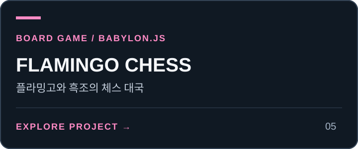

# Driving Practice · 도봉 운전 연습

<!-- PROJECT-LINKS:START -->
## 3D Playground

게임·공간·아바타를 한곳에서. 카드를 누르면 저장소로, 아래 버튼을 누르면 공개 데모 또는 실행 안내로 이동합니다.

<table>
<tr>
<td width="50%" valign="top">
<a href="https://github.com/minwoo19930301/seoul-flight-game"></a><br>
<a href="https://minwoo19930301.github.io/seoul-flight-game/"></a>
<a href="https://github.com/minwoo19930301/seoul-flight-game/pulls"></a><br>
<sub>중심 서울 일부 · 일반 건물 높이·외장 추정</sub><br>
<sub><a href="https://github.com/minwoo19930301/seoul-flight-game">저장소</a> · <a href="https://github.com/minwoo19930301/seoul-flight-game/pull/1">병합된 개선 PR #1</a></sub>
</td>
<td width="50%" valign="top">
<a href="https://github.com/minwoo19930301/parking-master-webasm"></a><br>
<a href="https://parking-master-webasm.vercel.app/"></a>
<a href="https://github.com/minwoo19930301/parking-master-webasm/pulls"></a><br>
<sub>공개 데모는 이전 버전 · 최신 소스는 저장소</sub><br>
<sub><a href="https://github.com/minwoo19930301/parking-master-webasm">저장소</a> · <a href="https://github.com/minwoo19930301/parking-master-webasm/pull/2">병합된 개선 PR #2</a></sub>
</td>
</tr>
<tr>
<td width="50%" valign="top">
<a href="https://github.com/minwoo19930301/interior3d"></a><br>
<a href="https://minwoo19930301.github.io/interior3d/"></a>
<a href="https://github.com/minwoo19930301/interior3d/pulls"></a><br>
<sub>공개 데모는 이전 버전 · 19종 모델은 최신 소스</sub><br>
<sub><a href="https://github.com/minwoo19930301/interior3d">저장소</a> · <a href="https://github.com/minwoo19930301/interior3d/pull/1">병합된 개선 PR #1</a></sub>
</td>
<td width="50%" valign="top">
<a href="https://github.com/minwoo19930301/animal-metaverse"></a><br>
<a href="https://minwoo19930301.github.io/animal-metaverse/"></a>
<a href="https://github.com/minwoo19930301/animal-metaverse/pulls"></a><br>
<sub>3D 3종 + 2D 3종 · 아래에서 바로 선택</sub><br>
<sub><a href="https://github.com/minwoo19930301/animal-metaverse">저장소</a> · <a href="https://github.com/minwoo19930301/animal-metaverse/pull/1">병합된 개선 PR #1</a></sub>
</td>
</tr>
<tr>
<td width="50%" valign="top">
<a href="https://github.com/minwoo19930301/flamingo-chess"></a><br>
<a href="https://minwoo19930301.github.io/flamingo-chess/"></a>
<a href="https://github.com/minwoo19930301/flamingo-chess/pulls"></a><br>
<sub>플라밍고 vs 흑조 · AI 대국</sub><br>
<sub><a href="https://github.com/minwoo19930301/flamingo-chess">저장소</a> · <a href="https://github.com/minwoo19930301/flamingo-chess/pull/1">병합된 개선 PR #1</a></sub>
</td>
<td width="50%" valign="top">
<a href="https://github.com/minwoo19930301/animal-hood-girl-vtuber"></a><br>
<a href="https://github.com/minwoo19930301/animal-hood-girl-vtuber#실행"></a>
<a href="https://github.com/minwoo19930301/animal-hood-girl-vtuber/pulls"></a><br>
<sub>macOS 로컬 앱 · 웹 플레이 링크 없음</sub><br>
<sub><a href="https://github.com/minwoo19930301/animal-hood-girl-vtuber">저장소</a> · <a href="https://github.com/minwoo19930301/animal-hood-girl-vtuber/pull/1">병합된 개선 PR #1</a></sub>
</td>
</tr>
</table>

### ANIMALVERSE · 여섯 세계 바로가기

<p>
<a href="https://minwoo19930301.github.io/animal-metaverse/versions/3d/"></a>
<a href="https://minwoo19930301.github.io/animal-metaverse/versions/3d-r3f/"></a>
<a href="https://minwoo19930301.github.io/animal-metaverse/versions/3d-babylon/"></a>
<a href="https://minwoo19930301.github.io/animal-metaverse/versions/2d-pixel/"></a>
<a href="https://minwoo19930301.github.io/animal-metaverse/versions/2d-pastel/"></a>
<a href="https://minwoo19930301.github.io/animal-metaverse/versions/2d-iso/"></a>
</p>

<sub>2026-09-07 확인: 공개 데모 5곳과 ANIMALVERSE 세부 경로 6곳은 HTTP 응답 확인. 화면·조작 검증을 뜻하지 않습니다. 위 개선 PR 6개는 병합됐습니다. Interior3D 공개 데모는 이전 배포이며, Driving Practice 공개 데모의 최신 확장 반영도 확인되지 않았습니다. “최신 PR”에는 병합 전 변경이 포함될 수 있습니다.</sub>

<!-- PROJECT-LINKS:END -->

도봉운전면허시험장 서남쪽 보통면허 코스의 항공 관찰, 주변 건물·도로·철도 좌표, 실제 지형 고도를 연결한 WebAssembly 주행 프로젝트입니다. **현행 시험장과 동일하다고 검증된 복제품은 아닙니다.** 기존의 가상 기능시험 배치와 채점 연습은 별도 모드로 유지합니다.

기존 개선 PR #2는 병합됐지만, 공개 데모에서 최신 도로주행 확장이 배포됐는지는 확인되지 않았습니다. 기존 공개 서비스와 아래 개발 결과를 혼동하지 마세요. 한국도로교통공단의 공식·승인 서비스가 아닙니다.

## 세 주행 모드

- **공개지도에서 운전:** 관찰된 코스 포장면과 섬, 주차 접근부, 주변 실제 지도 위치를 사용합니다. 현재 경사로의 실제 높이, 정지선, 현행 운영 경로는 검증되지 않아 공식 코스 채점을 하지 않습니다.
- **도로주행 A/B/C/D:** 공식 안내 영상·도면과 실제 OSM 도로 좌표를 결합한 각각 약5.6~5.8km 경로입니다. 다음 회전 거리, 순서별 진행, 정지 후 완주, 선택 코스 재시작, 무작위 주변 차량을 제공합니다. 차로 폭·유턴 공간·신호·고저는 현장 복제가 아닌 연습용 단순화이며 도로주행 감점은 하지 않습니다. 자세한 [경로 출처와 한계](docs/road-driving/README.md)를 확인하세요.
- **규칙 연습 · 가상 배치:** 출발·경사로·교차로·주차·가속 상태 머신을 보존한 별도의 가상 코스입니다. 그 좌표와 경사 형상을 실제 도봉 측량값으로 취급하면 안 됩니다. 법규·감점 안내도 실제 응시 전 최신 공식 안내를 확인해야 합니다.

주변 풍경은 OSM 건물 외곽선·도로·철도·송전 시설과 USGS 기반 DEM으로 배치합니다. 옛 임의의 아파트 배열과 가짜 산 실루엣은 공개지도 모드에서 사용하지 않습니다. 미공개 건물 높이, 외장, 교각·송전선 형상은 명시적인 추정 표현입니다. 현장 사진과 일치하는 외관으로 검증되지는 않았습니다. 기준점·출처·정확도는 [자료 기록](docs/dobong/PROVENANCE.md)을 참고하세요.

## 조작

발 입력은 **키보드만** 사용합니다. 핸들은 화면 안에 전체 원이 보이며 마우스/터치 원형 드래그 또는 키보드로 조향합니다. 모바일도 가속·브레이크에는 물리 키보드가 필요합니다.

| 기능 | 키보드 | 화면 |
|---|---|---|
| 가속 | W / ↑ | 페달 버튼 없음 |
| 브레이크 | S / ↓ / Space | 페달 버튼 없음 |
| 조향 | A / D 또는 ← / → | 전체 휠 드래그, 선택적 기울기 입력 |
| 기어 P / D / R | 0 / 1 / 2 | P/D/R 레버 |
| 방향지시등 | Z / X | 지시등 레버 |
| 비상등 / 주차브레이크 | C / B | 해당 스위치 |
| 시동 / 전조등 / 와이퍼 / 안전띠 | I / L / V / K | 해당 버튼 |
| 자유주행 / 다시 시작 | F / R | 메뉴 버튼 |
| 운전석 / 3인칭 시점 | T | 시점 전환 버튼 |
| 도로주행 A/B/C/D | 네이티브 6/7/8/9 | 메뉴의 A/B/C/D 버튼 |

휠 시각 회전 범위는 좌우 360°입니다. 특정 시험차의 실제 조향비로 보정된 수치는 아닙니다. 메뉴·튜토리얼·탭 전환 때 입력과 시간이 멈추고, 이어서 운전하면 같은 상태에서 재개합니다. 페달에 연결된 여러 키를 동시에 눌러도 한 키를 뗐다고 나머지 입력까지 해제하지 않습니다.

3인칭은 차량 뒤쪽 추적 카메라로 전환하며 조작·차량 상태를 초기화하지 않습니다. 이 시점에서도 전체 휠과 속도·기어 표시를 유지합니다. 저장소 URL은 기존 `parking-master-webasm`을 유지합니다.

## 개발과 검증

CMake, Ninja, Emscripten, C++17 컴파일러와 Node.js가 필요합니다.

```sh
npm test
npm run test:sources
npm run build:web
npm run preview
```

미리보기는 `http://127.0.0.1:4173`입니다. `npm run build:sites`는 정적 산출물을 준비하며 배포를 수행하지 않습니다.

자동 검사는 채점 규칙, 20/30/60/120Hz 차량 물리, 30개 화면 크기에서 전체 휠의 기하학적 경계, 키보드·메뉴·튜토리얼 입력, 실제 코스 도형의 차량 시작 구간, 지도 좌표와 DEM 유효성을 다룹니다. 셸 검사는 Node의 대역을 사용합니다. 이 결과는 브라우저 WebGL 렌더링, 핸들 포인터 조작, 센서, 성능 또는 현장 일치 검증을 대신하지 않습니다.

소스와 셸을 수정한 뒤에는 웹 빌드를 실행해 `index.html`, `index.js`, `index.wasm`을 함께 갱신해야 합니다.

## 구조

- `src/dobong/` — 출처가 연결된 코스·주변·DEM 데이터와 지도 렌더러
- `docs/dobong/` — GeoJSON, 생성 메타데이터, 출처와 미확인 사항
- `src/main.cpp` — 주행·기존 채점 상태 머신·3D 화면·미러
- `src/cockpit_layout.h` — 화면 내 전체 휠 배치
- `src/vehicle_physics.h`, `src/exam_rules.h` — 차량 및 규칙 계산
- `web/shell.html` — 메뉴·키보드 페달·휠 입력
- `tests/` — CPU/입력 회귀 검사
- `tools/dobong-data/` — 입력 5개와 헤더 3개 SHA를 검증하는 오프라인 재생성 자료
- `scripts/build-web.sh` — WebAssembly와 정적 번들 생성

## 출처와 권리

[공식 도봉 코스 안내](https://www.koroad.or.kr/main/board/9/87986/board_view.do?bcstIdx1=61&bcstIdx2=74)는 절차·연결관계 참고 자료이며 측량 도면이 아닙니다. 항공 원본과 공식 PDF는 이 저장소에 재배포하지 않습니다. 이미지에서 관찰한 도형도 측량값이 아닙니다.

지도: © [OpenStreetMap contributors](https://www.openstreetmap.org/copyright), ODbL 1.0. 지형: Mapzen 및 USGS SRTM/GMTED2010, [Terrain Tiles](https://registry.opendata.aws/terrain-tiles/). 데이터별 출처·라이선스와 추정값은 [PROVENANCE.md](docs/dobong/PROVENANCE.md)에 기록합니다.
